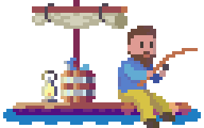

# TADZIU'S FISHING ADVENTURE 🎣
**Poznan University of Technology 🎓** \
*Structural and Object-Oriented Programming* \
Team Project with **Ignacy Chrobak** ([@‌saladtopfive](https://github.com/saladtopfive))

## About
**"Tadziu's Fishing Adventure"** [version 0.3.1]\
Tadziu - our friend from Bydgoszcz - takes on a fishing adventure to earn some fame. 🎣 \

🎣 [Trello Board](https://trello.com/b/PKK7mM5n/psio-team-project) \
🎣 [Figma Concept/Mood Board](https://www.figma.com/file/woyPS8ISQzgJqNXyHCYecT/Tadziu's-Fishing-Adventures?type=design&node-id=0%3A1&t=YevXVrn1Su3Uy0Kf-1)

> [!CAUTION]
> Work on the project has been suspended. \
> State: incomplete and core features missing.

## Acknowledgments
**Thanks to:** \
Tadeusz Bugalski ([@Tadeq-hash](https://github.com/Tadeq-hash)), who agreed to be depicted as a main hero. ❤

**Free to use resources used in the project:**
- [**CRAFTPIX.NET** — FREE FISHING GAME ASSETS PIXEL ART PACK](https://craftpix.net/freebies/free-fishing-game-assets-pixel-art-pack/)
- [**CRAFTPIX.NET** — FREE CITY BACKGROUNDS PIXEL ART](https://craftpix.net/freebies/free-city-backgrounds-pixel-art/)
- [**ITCH.IO** — FREE RPG ASSET TILESET MARKETPLACE PACK](https://gif-superretroworld.itch.io/marketplace) by [**@GIF**](https://twitter.com/gif_not_jif)
- [**ITCH.IO** — COZY FISHING ASSET PACK](https://shubibubi.itch.io/cozy-fishing) by [**@SHUBIBUBI**](https://shubibubi.itch.io/)
- [**DAFONT.COM** — UPHEAVAL](https://www.dafont.com/upheaval.font)
- [**FONTAWESOME.COM**](https://fontawesome.com/) provided us with icons (we made them pixelated)!
- [**MIXKIT.CO**](https://mixkit.co/free-sound-effects/) provided us with music ans sound!

Powered by **SFML 2.5.1** \

<!---->
