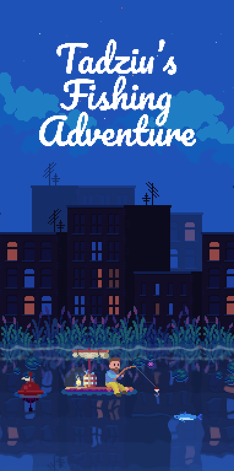

**Poznan University of Technology 🎓** \
*Structural and Object-Oriented Programming* \
Team Project with [@‌IgnacyChrobak](https://github.com/saladtopfive)

<!--

-->

**"Tadziu's Fishing Adventure"** \
Tadziu - bydgoski znajomy twórców - wyrusza na wędkarską wyprawę, by zyskać chwałę. 🎣 \
Tadziu - Our friend from Bydgoszcz - takes on a fishing adventure to get fameous. 🎣 \
*Inspired by ["Cat goes fishing"](https://store.steampowered.com/app/343780/Cat_Goes_Fishing/) and ["Fishing.io"](https://www.crazygames.com/game/fishing-io)*

———

🎣 [Trello Board](https://trello.com/b/PKK7mM5n/psio-team-project) \
🎣 [Figma Concept/Mood Board](https://www.figma.com/file/woyPS8ISQzgJqNXyHCYecT/Tadziu's-Fishing-Adventures?type=design&node-id=0%3A1&t=YevXVrn1Su3Uy0Kf-1)

———

**Thanks to:** \
Tadeusz Bugalski ([@Tadeq-hash](https://github.com/Tadeq-hash)), who agreed to be depicted as main hero. ❤ \
Tadeusz Bugalski ([@Tadeq-hash](https://github.com/Tadeq-hash)), który zezwolił na przedstawienie jako główny bohater. ❤

**Free to use resources used in the project:**
- [**@CRAFTPIX.NET** — FREE FISHING GAME ASSETS PIXEL ART PACK](https://craftpix.net/freebies/free-fishing-game-assets-pixel-art-pack/)
- [**@CRAFTPIX.NET** — FREE CITY BACKGROUNDS PIXEL ART](https://craftpix.net/freebies/free-city-backgrounds-pixel-art/)
- [**ITCH.IO** — FREE RPG ASSET TILESET MARKETPLACE PACK](https://gif-superretroworld.itch.io/marketplace) by [@GIF](https://twitter.com/gif_not_jif)
- [**ITCH.IO** — **@SHUBIBUBI**'s COZY FISHING ASSET PACK](https://shubibubi.itch.io/cozy-fishing)
- [**@FONTAWESOME.COM**](https://fontawesome.com/) provided Us with icons (We made them pixelated)!
- [**@MIXKIT.CO**](https://mixkit.co/free-sound-effects/) provided Us with music ans sound!
